# State Transition Diagrams

Document status: Draft v0.1 (Stage 2 part 2). Proposed. Diagram syntax was checked with a Mermaid 10.9.1 parser (all diagram blocks in the package were re-rendered with Mermaid CLI 10.9.1 in Phase 2 (101 blocks, 0 errors)). The diagrams have **not been visually rendered or reviewed for layout**.
Status lists match the [Data Dictionary](../04-System-Architecture/Data-Dictionary.md) section 2. Transition labels name the trigger. Terminal states have no outgoing transition, except those marked reversible.

## 1. Purchase requisition

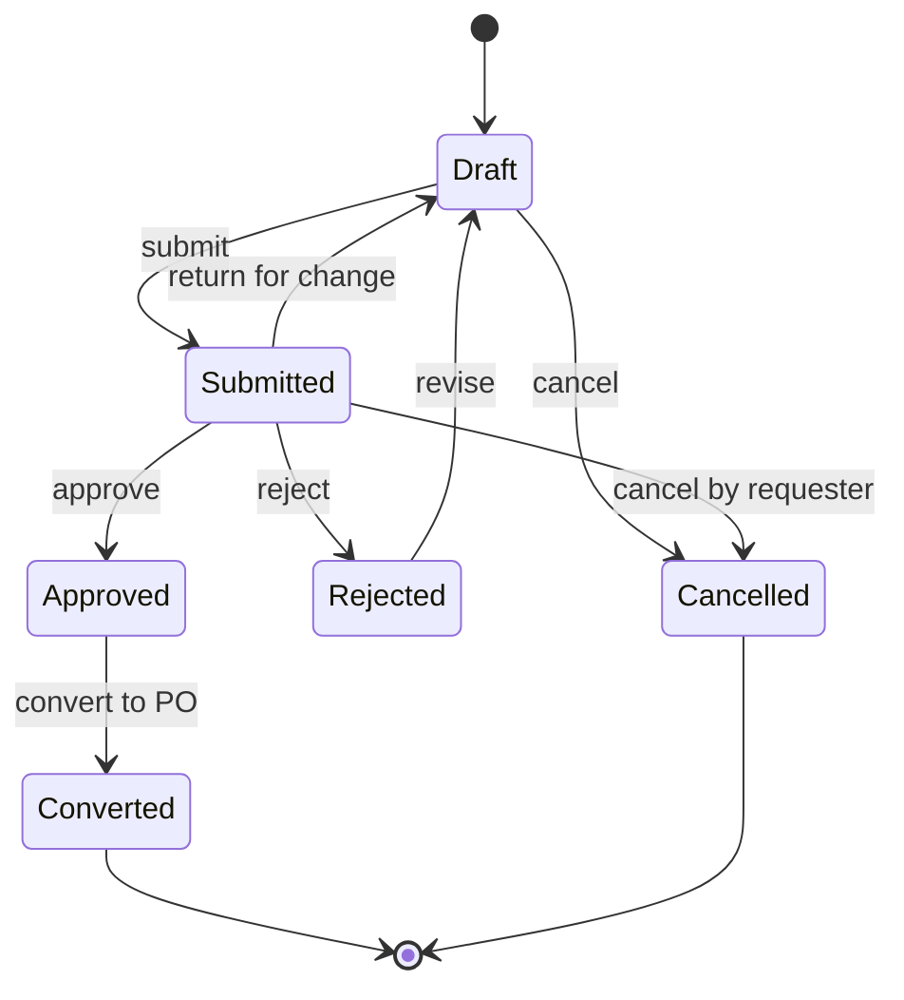
```mermaid
stateDiagram-v2
    [*] --> Draft
    Draft --> Submitted: submit
    Submitted --> Approved: approve
    Submitted --> Rejected: reject
    Submitted --> Draft: return for change
    Approved --> Converted: convert to PO
    Draft --> Cancelled: cancel
    Submitted --> Cancelled: cancel by requester
    Rejected --> Draft: revise
    Converted --> [*]
    Cancelled --> [*]
```

## 2. Purchase order

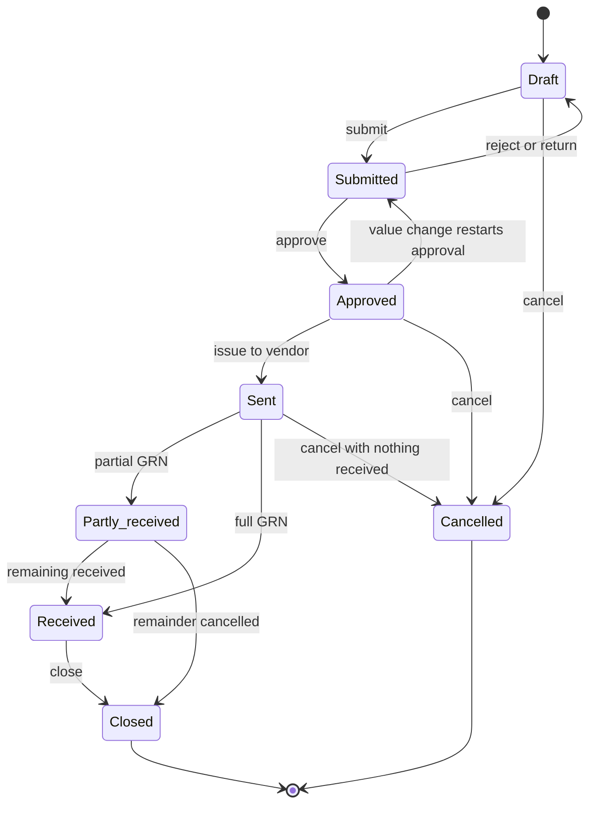
```mermaid
stateDiagram-v2
    [*] --> Draft
    Draft --> Submitted: submit
    Submitted --> Approved: approve
    Submitted --> Draft: reject or return
    Approved --> Sent: issue to vendor
    Approved --> Submitted: value change restarts approval
    Sent --> Partly_received: partial GRN
    Sent --> Received: full GRN
    Partly_received --> Received: remaining received
    Partly_received --> Closed: remainder cancelled
    Received --> Closed: close
    Draft --> Cancelled: cancel
    Approved --> Cancelled: cancel
    Sent --> Cancelled: cancel with nothing received
    Closed --> [*]
    Cancelled --> [*]
```

## 3. Purchase invoice

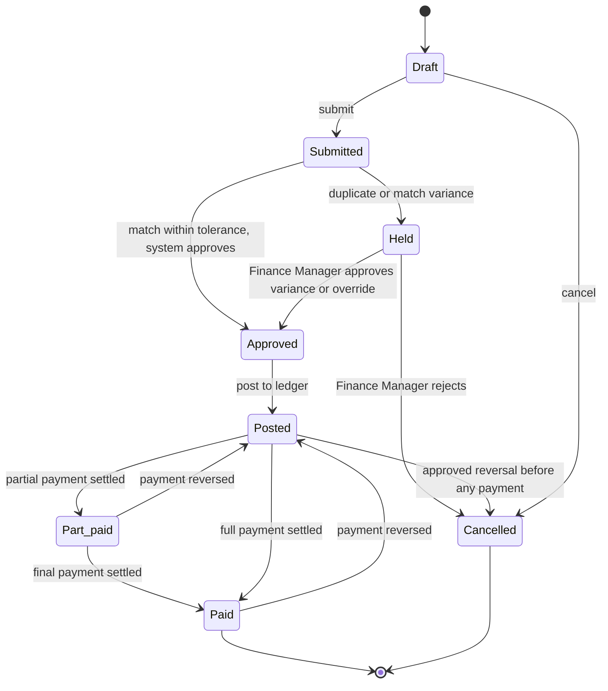
```mermaid
stateDiagram-v2
    [*] --> Draft
    Draft --> Submitted: submit
    Submitted --> Approved: match within tolerance, system approves
    Submitted --> Held: duplicate or match variance
    Held --> Approved: Finance Manager approves variance or override
    Held --> Cancelled: Finance Manager rejects
    Approved --> Posted: post to ledger
    Posted --> Part_paid: partial payment settled
    Part_paid --> Paid: final payment settled
    Posted --> Paid: full payment settled
    Part_paid --> Posted: payment reversed
    Paid --> Posted: payment reversed
    Posted --> Cancelled: approved reversal before any payment
    Draft --> Cancelled: cancel
    Paid --> [*]
    Cancelled --> [*]
```

## 4. Sales order

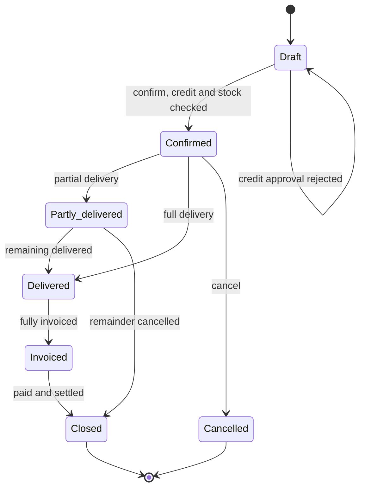
```mermaid
stateDiagram-v2
    [*] --> Draft
    Draft --> Confirmed: confirm, credit and stock checked
    Draft --> Draft: credit approval rejected
    Confirmed --> Partly_delivered: partial delivery
    Confirmed --> Delivered: full delivery
    Partly_delivered --> Delivered: remaining delivered
    Delivered --> Invoiced: fully invoiced
    Invoiced --> Closed: paid and settled
    Confirmed --> Cancelled: cancel
    Partly_delivered --> Closed: remainder cancelled
    Closed --> [*]
    Cancelled --> [*]
```

## 5. Delivery

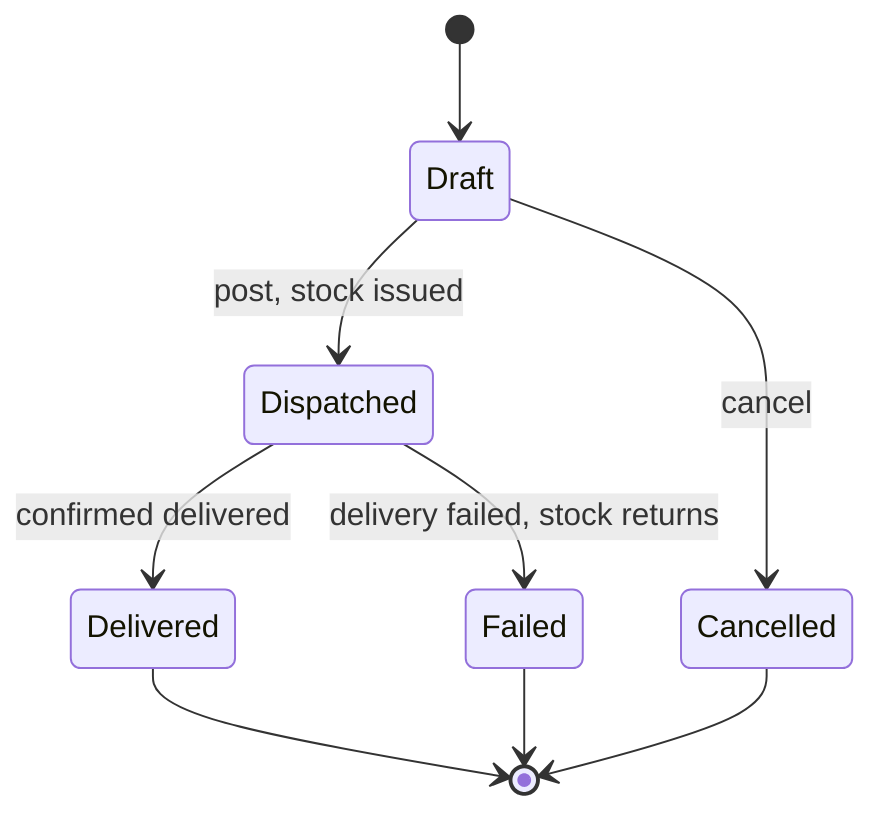
```mermaid
stateDiagram-v2
    [*] --> Draft
    Draft --> Dispatched: post, stock issued
    Dispatched --> Delivered: confirmed delivered
    Dispatched --> Failed: delivery failed, stock returns
    Draft --> Cancelled: cancel
    Delivered --> [*]
    Failed --> [*]
    Cancelled --> [*]
```

## 6. Sales invoice and credit note

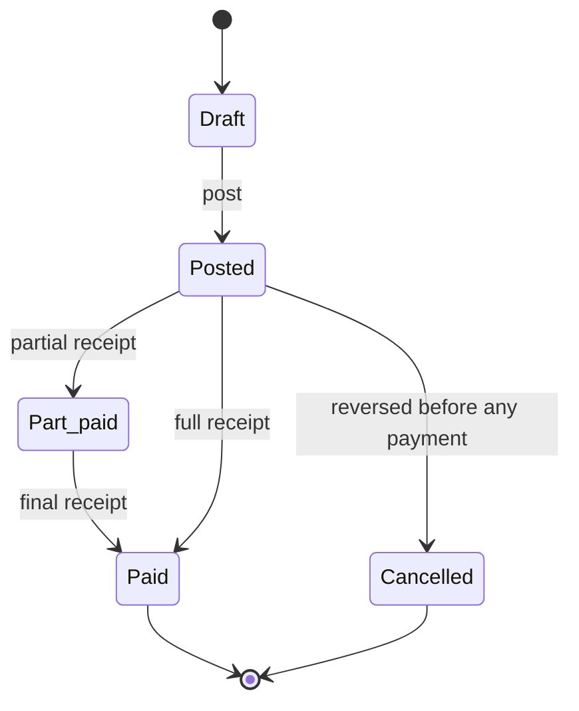
```mermaid
stateDiagram-v2
    [*] --> Draft
    Draft --> Posted: post
    Posted --> Part_paid: partial receipt
    Part_paid --> Paid: final receipt
    Posted --> Paid: full receipt
    Posted --> Cancelled: reversed before any payment
    Paid --> [*]
    Cancelled --> [*]
```

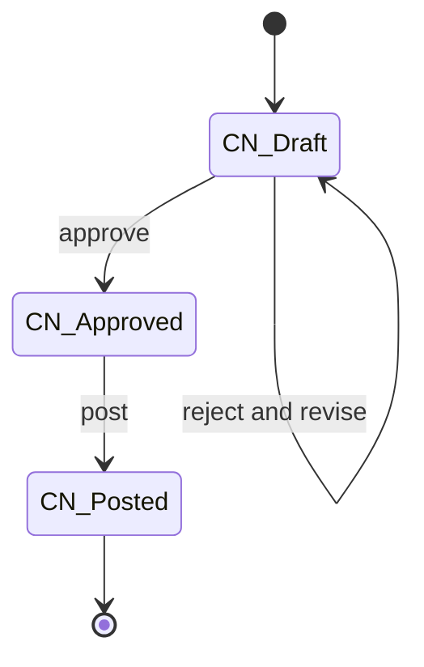
```mermaid
stateDiagram-v2
    [*] --> CN_Draft
    CN_Draft --> CN_Approved: approve
    CN_Approved --> CN_Posted: post
    CN_Draft --> CN_Draft: reject and revise
    CN_Posted --> [*]
```

## 7. Payment

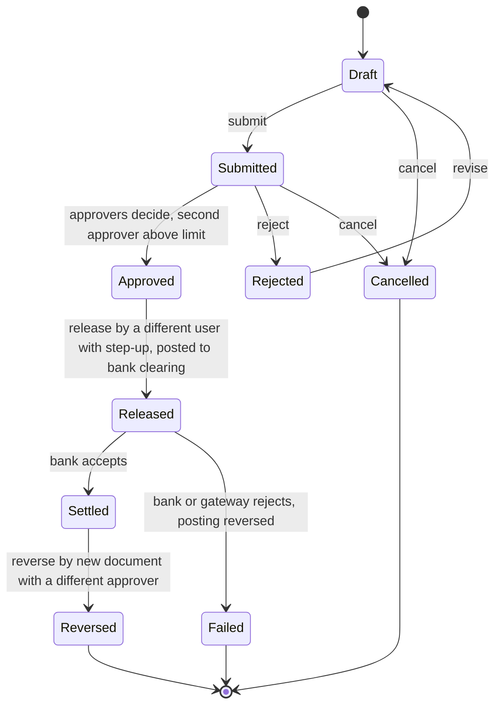
```mermaid
stateDiagram-v2
    [*] --> Draft
    Draft --> Submitted: submit
    Submitted --> Approved: approvers decide, second approver above limit
    Submitted --> Rejected: reject
    Rejected --> Draft: revise
    Draft --> Cancelled: cancel
    Submitted --> Cancelled: cancel
    Approved --> Released: release by a different user with step-up, posted to bank clearing
    Released --> Settled: bank accepts
    Released --> Failed: bank or gateway rejects, posting reversed
    Settled --> Reversed: reverse by new document with a different approver
    Failed --> [*]
    Cancelled --> [*]
    Reversed --> [*]
```

## 8. Journal

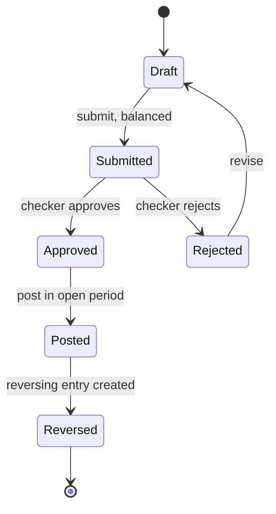
```mermaid
stateDiagram-v2
    [*] --> Draft
    Draft --> Submitted: submit, balanced
    Submitted --> Approved: checker approves
    Submitted --> Rejected: checker rejects
    Rejected --> Draft: revise
    Approved --> Posted: post in open period
    Posted --> Reversed: reversing entry created
    Reversed --> [*]
```

## 9. Fiscal period and year

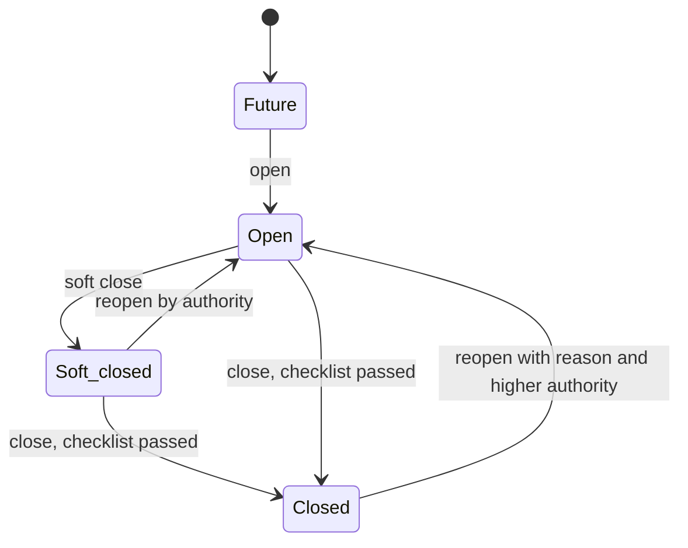
```mermaid
stateDiagram-v2
    [*] --> Future
    Future --> Open: open
    Open --> Soft_closed: soft close
    Soft_closed --> Open: reopen by authority
    Soft_closed --> Closed: close, checklist passed
    Open --> Closed: close, checklist passed
    Closed --> Open: reopen with reason and higher authority
```

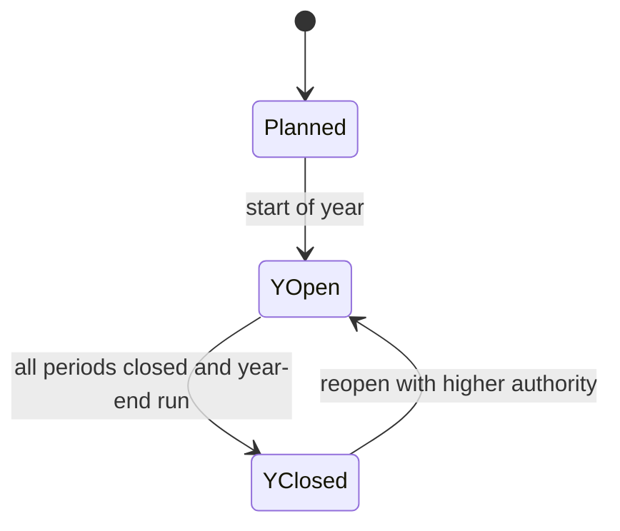
```mermaid
stateDiagram-v2
    [*] --> Planned
    Planned --> YOpen: start of year
    YOpen --> YClosed: all periods closed and year-end run
    YClosed --> YOpen: reopen with higher authority
```

## 10. Stock transfer and adjustment

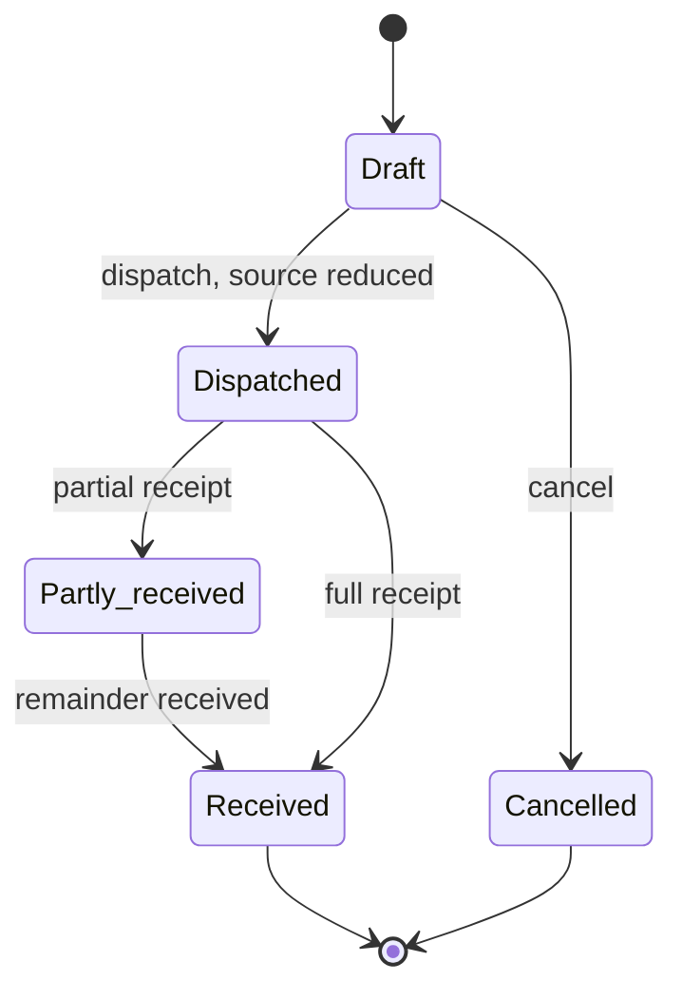
```mermaid
stateDiagram-v2
    [*] --> Draft
    Draft --> Dispatched: dispatch, source reduced
    Dispatched --> Partly_received: partial receipt
    Partly_received --> Received: remainder received
    Dispatched --> Received: full receipt
    Draft --> Cancelled: cancel
    Received --> [*]
    Cancelled --> [*]
```

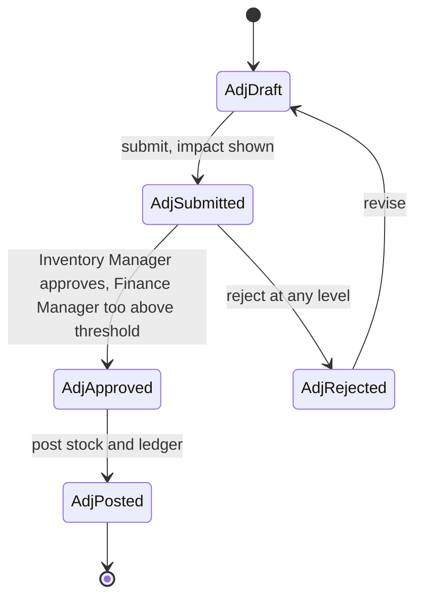
```mermaid
stateDiagram-v2
    [*] --> AdjDraft
    AdjDraft --> AdjSubmitted: submit, impact shown
    AdjSubmitted --> AdjApproved: Inventory Manager approves, Finance Manager too above threshold
    AdjSubmitted --> AdjRejected: reject at any level
    AdjRejected --> AdjDraft: revise
    AdjApproved --> AdjPosted: post stock and ledger
    AdjPosted --> [*]
```

## 11. Stock reservation

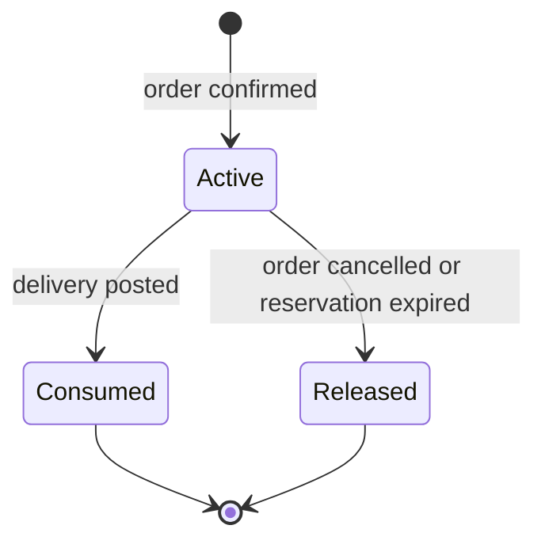
```mermaid
stateDiagram-v2
    [*] --> Active: order confirmed
    Active --> Consumed: delivery posted
    Active --> Released: order cancelled or reservation expired
    Consumed --> [*]
    Released --> [*]
```

## 12. Approval instance

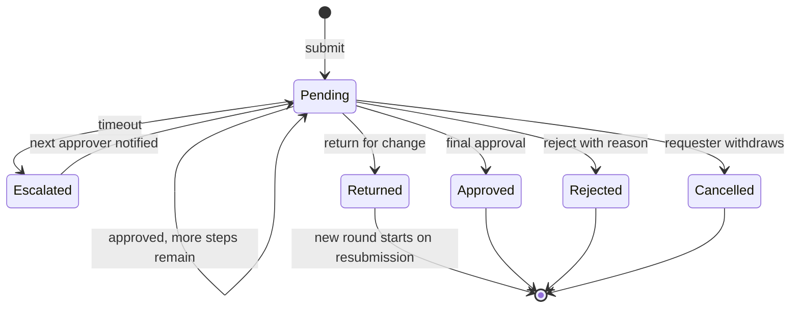
```mermaid
stateDiagram-v2
    [*] --> Pending: submit
    Pending --> Escalated: timeout
    Escalated --> Pending: next approver notified
    Pending --> Pending: approved, more steps remain
    Pending --> Approved: final approval
    Pending --> Rejected: reject with reason
    Pending --> Returned: return for change
    Pending --> Cancelled: requester withdraws
    Returned --> [*]: new round starts on resubmission
    Approved --> [*]
    Rejected --> [*]
    Cancelled --> [*]
```

## 13. User account

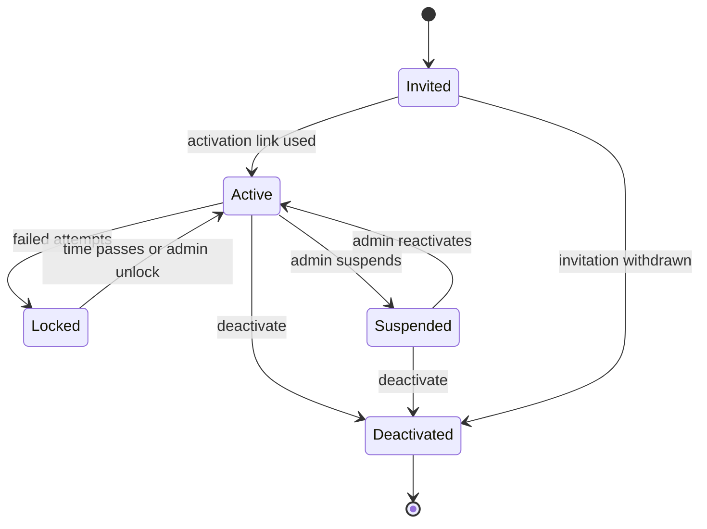
```mermaid
stateDiagram-v2
    [*] --> Invited
    Invited --> Active: activation link used
    Active --> Locked: failed attempts
    Locked --> Active: time passes or admin unlock
    Active --> Suspended: admin suspends
    Suspended --> Active: admin reactivates
    Active --> Deactivated: deactivate
    Suspended --> Deactivated: deactivate
    Invited --> Deactivated: invitation withdrawn
    Deactivated --> [*]
```

## 14. Vendor

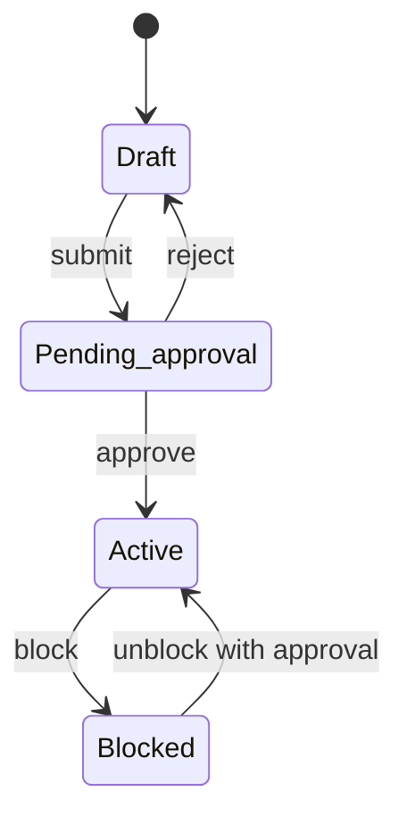
```mermaid
stateDiagram-v2
    [*] --> Draft
    Draft --> Pending_approval: submit
    Pending_approval --> Active: approve
    Pending_approval --> Draft: reject
    Active --> Blocked: block
    Blocked --> Active: unblock with approval
```

## 15. Financial transaction lifecycle (cross-document view)

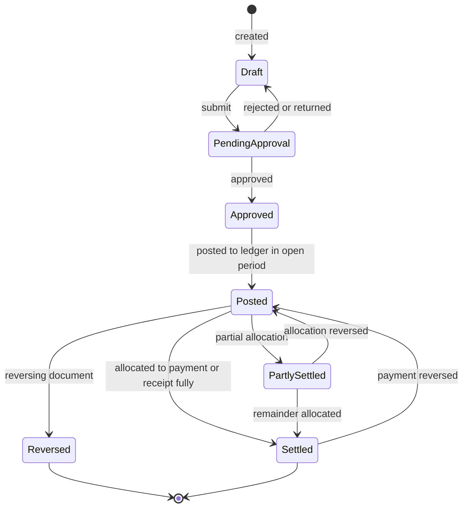
```mermaid
stateDiagram-v2
    [*] --> Draft: created
    Draft --> PendingApproval: submit
    PendingApproval --> Draft: rejected or returned
    PendingApproval --> Approved: approved
    Approved --> Posted: posted to ledger in open period
    Posted --> Settled: allocated to payment or receipt fully
    Posted --> PartlySettled: partial allocation
    PartlySettled --> Settled: remainder allocated
    PartlySettled --> Posted: allocation reversed
    Settled --> Posted: payment reversed
    Posted --> Reversed: reversing document
    Reversed --> [*]
    Settled --> [*]
```

Rule common to all: a posted document is never edited. Correction is a reversal or credit document (BRL-017).

## 16. Coverage

Statuses in the [Data Dictionary](../04-System-Architecture/Data-Dictionary.md) with no diagram: role, customer, item, goods receipt, quotation, sales return, fiscal-year detail beyond section 9, import batch, outbox event, notification. They are simple linear lists. Diagrams can be added on request.

## Phase 2 note (v0.2)

The state diagrams for WF-04, WF-05, WF-08, WF-09 and WF-13 are in the Lifecycles folder (`Lifecycles/WF-nn-*.md`). WF-01, WF-06 and WF-12 diagrams follow the [Authoritative Workflow Definitions](Authoritative-Workflow-Definitions.md).
